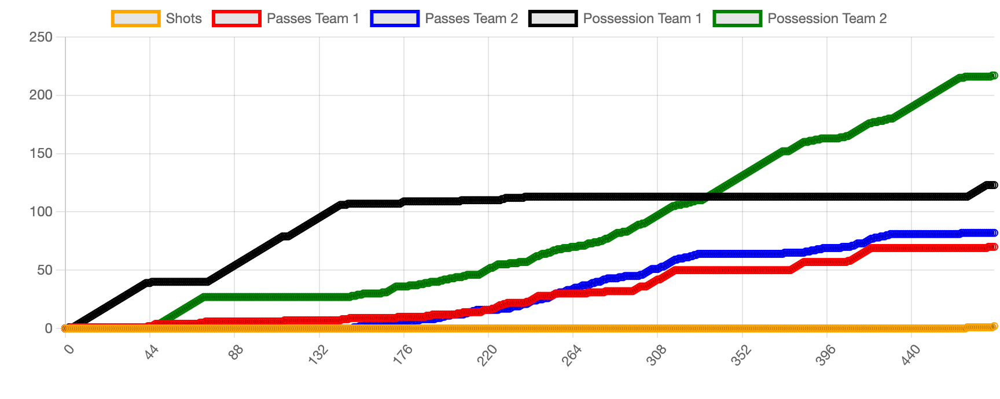
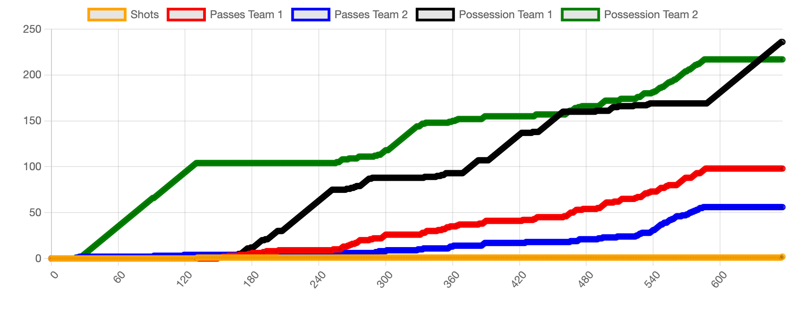
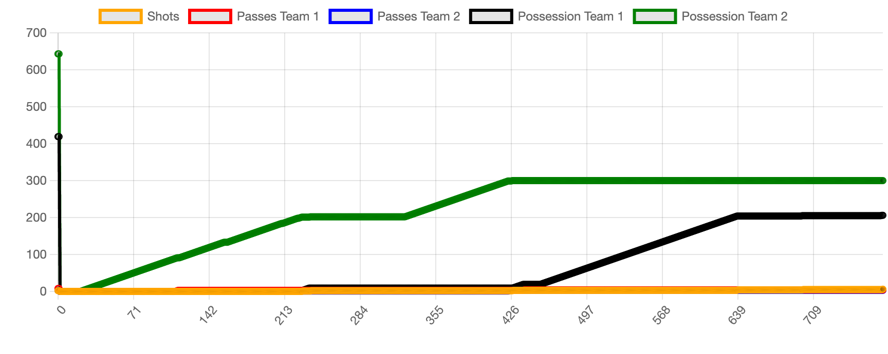
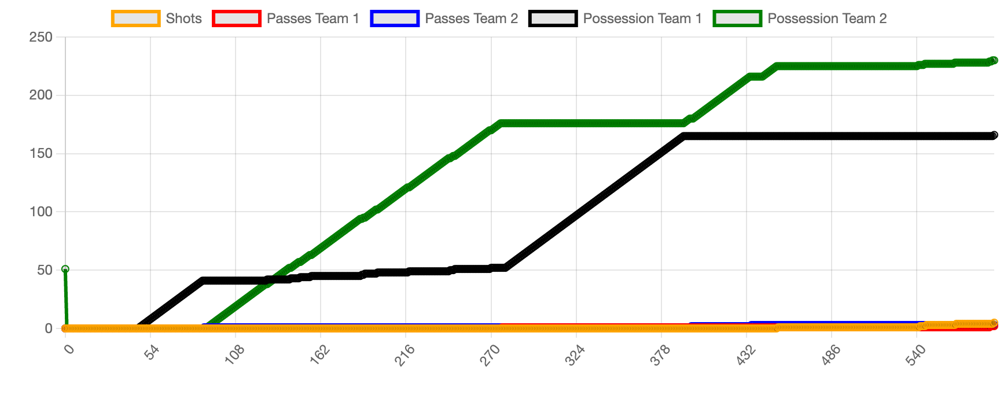

## How to run

```bash
# Install dependencies
make install
# Run server
make run
```

## Notes

- Team 1: Red
- Team 2: Blue
- Set the frames per second to 0 (it's too slow)


## Liens

- [Deepmind Article](https://www.deepmind.com/blog/advancing-sports-analytics-through-ai-research)
- [Kaggle Competition](https://www.kaggle.com/c/google-football)
- [Google Football Repo](https://github.com/google-research/football)


## Simulations

### Game 1 (new utility)



| Team | Possession | Passes |
|------|------------|--------|
| 1    | 123        | 70     |
| 2    | 217        | 82     | 

- Winner: **Team 2**

### Game 2 (new utility)



| Team | Possession | Passes |
|------|------------|--------|
| 1    | 236        | 98     |
| 2    | 217        | 56     | 

- Winner: **Team 1**

### Game 3 (old/simple utility)



| Team | Possession | Passes |
|------|------------|--------|
| 1    | 206        | 4      |
| 2    | 300        | 3      | 

- Winner: **Team 1**

### Game 4 (old/simple utility)



| Team | Possession | Passes |
|------|------------|--------|
| 1    | 166        | 2      |
| 2    | 230        | 4      | 

- Winner: **Team 2**